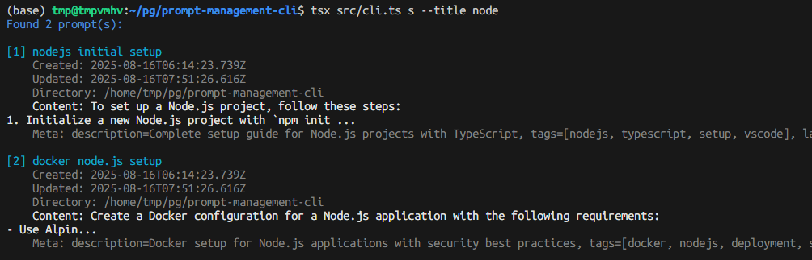

# Prompt Management CLI (PMC)

A CLI tool for managing AI prompts with search and organization capabilities. PMC provides a personal, secure prompt library that allows you to store, search, and manage prompts for various AI coding agents and tools.

## Philosophy

Many AI coding agent tools (Claude Code, Gemini CLI, Kiro, Cursor, GitHub Copilot Agent, etc.) are CLI-based. PMC eliminates the manual overhead of thinking up, remembering, or copy-pasting prompts by providing AI agents with meta-programmatic understanding of your prompt library.



## Features

- **Personal & Secure**: Local storage in `~/.pmc/prompts.md` 
- **CLI-based**: Seamless integration with your terminal workflow
- **Search & Filter**: Powerful search by directory, text content, metadata, and dates
- **Version Control**: Built-in Git integration for prompt history and collaboration
- **File Watching**: Auto-sync metadata when prompts.md changes
- **Custom File Support**: Use `--prompts-file` for project-specific prompt files
- **Markdown Format**: Human-readable storage with TOML metadata
- **Real-time Monitoring**: Watch mode for live prompt file changes

## Installation

### Quick Installation (Recommended)

```bash
curl -fsSL https://raw.githubusercontent.com/prompt-management/cli/main/install.sh | bash
```

### Manual Installation

```bash
# Clone the repository
git clone https://github.com/prompt-management/cli.git
cd cli

# Install dependencies
npm install

# Build the project
npm run build

# Install globally
npm install -g .
```

### Development Installation

```bash
# Clone the repository
git clone https://github.com/prompt-management/cli.git
cd cli

# Install dependencies
npm install

# Run in development mode
npm run dev
```

## Uninstallation

To completely remove PMC from your system:

```bash
# Interactive uninstall (with confirmation prompt)
pmc uninstall

# Uninstall without confirmation
pmc uninstall --confirm
```

This will remove:
- Installation directory (`~/.pmc-cli/`)
- Binary symlink (`~/.local/bin/pmc`)
- Configuration and all stored prompts (`~/.pmc/`)
- PATH modifications from shell configuration files

## Usage

### Help

```bash
$ pmc --help
Usage: pmc [options] [command]

Prompt Management CLI - A tool for managing AI prompts

Options:
  -V, --version                    output the version number
  --prompts-file <path>           specify custom prompts.md file path
  -h, --help                      display help for command

Commands:
  create|c [options]              Create a new prompt
  search|s [options]              Search prompts with flexible filtering
  edit|e [options]                Edit prompts
  list|ls [options]               List all prompts
  show <title>                    Show full content of a prompt by exact title
  generate|g [options]            Generate sample prompts
  watch|w [options]               Monitor changes to prompts.md
  history [options]               Show version history of prompts
  diff [version1] [version2]      Show differences between prompt versions
  restore <version> [options]     Restore prompts.md to a specific version
  versions [options]              List all available versions
  uninstall [options]             Uninstall PMC from the system
  help [command]                  display help for command
```

### Create a New Prompt

```bash
# Opens your default text editor to create a new prompt
pmc

# Or explicitly use the create command
pmc create
```

### Search Prompts

```bash
# Basic search by text content
pmc search --text "docker"
pmc s --text "kubernetes"

# Search by directory
pmc search --dir "/home/user/projects"

# Search with metadata
pmc search --meta "type=deployment"

# Combine filters
pmc search --text "api" --dir "/projects" --meta "env=production"

# Use regex (default) or disable it
pmc search --text "^deploy.*" 
pmc search --text "deploy" --text-regex-off

# Invert search results
pmc search --text "docker" --text-inverse
```

### Advanced Usage

#### Custom Prompts File
```bash
# Use project-specific prompts file
pmc --prompts-file ./project-prompts.md list
pmc --prompts-file /path/to/team-prompts.md search --text "deploy"
```

#### Version Control
```bash
# View prompt history
pmc history
pmc history -c 20  # Show 20 entries

# Compare versions
pmc diff abc123 def456
pmc diff  # Compare latest with previous

# Restore old version
pmc restore abc123
pmc restore abc123 --confirm  # Skip confirmation
```

#### File Watching
```bash
# Monitor prompts.md for changes
pmc watch
pmc watch --verbose  # Show detailed change info
```

#### Search Examples
```bash
# Search by title
pmc search --title "docker"

# Search by content
pmc search --text "kubernetes" 

# Search by metadata
pmc search --meta "tags=deployment"
pmc search --meta "category=devops"

# Search by date
pmc search --date-after "2024-01-01"
pmc search --date-after "7 days ago"

# Search by directory
pmc search --dir "/projects/webapp"

# Combine filters
pmc search --title "setup" --meta "tags=nodejs"

# Invert search results
pmc search --text "docker" --text-inverse
```

## File Structure

```
~/.pmc/
├── .git/                     # Git repository for version control
├── prompts.md               # Main prompts file (Markdown format)
├── prompts-system-meta.jsonl # System metadata (auto-generated)
├── pmc-config.yml           # Configuration file
└── .prompts-hash            # File change detection (auto-generated)
```

### Prompts Format

Prompts are stored in Markdown format with TOML metadata:

```markdown
# Docker Setup

How to set up Docker containers with Node.js applications.

<!--
[meta]
tags = ["docker", "nodejs", "deployment"]
category = "devops"
description = "Complete Docker setup guide"
-->

# Another Prompt

Content here...

<!--
[meta]
tags = ["example"]
-->
```

## Configuration

PMC configuration is stored in `~/.pmc/pmc-config.yml`:

```yaml
settings:
  colorEnabled: true
  ignoreKeysDuplicatesWarning: false
git:
  enabled: true
  autoCommit: true
  commitMessageFormat: "Update prompt: {title}"
```

## Development

### Running Tests

```bash
# Run all tests
npm test

# Run tests with coverage
npm test -- --coverage

# Run specific test
npm test -- test/utils.test.ts

# Development installation
chmod +x install-dev.sh
./install-dev.sh
```

### Test Structure

```
test/
├── utils.test.ts          # Utility function tests
├── prompt-manager.test.ts # Core prompt management tests  
├── search.test.ts         # Search functionality tests
├── pmc-manager.test.ts    # Integration tests
└── README.md              # Test documentation
```

## License

MIT License - see LICENSE file for details.

## Contributing

1. Fork the repository
2. Create your feature branch (`git checkout -b feature/amazing-feature`)
3. Run tests (`npm test`)
4. Commit your changes (`git commit -m 'Add amazing feature'`)
5. Push to the branch (`git push origin feature/amazing-feature`)
6. Open a Pull Request